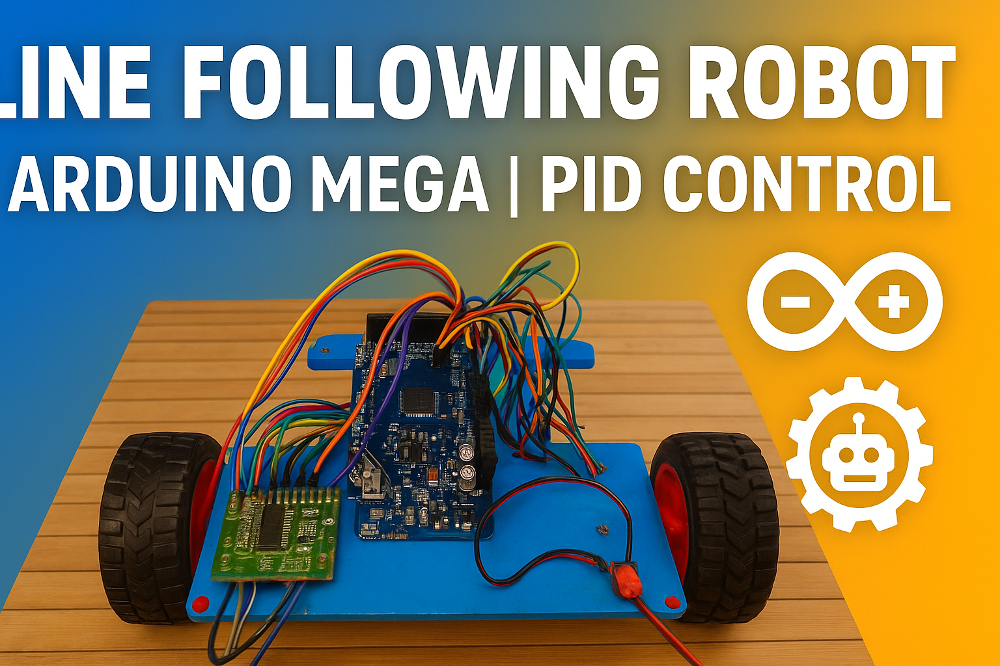

# 🤖 Line Following Robot

## 📌 Abstract
The **Line Following Robot** is an autonomous mobile robot built using **Arduino Mega, IR sensors, and L293D motor driver IC**.  
It is designed to follow a black line path on a white surface using **PID control logic**, demonstrating real-world applications of **control systems, robotics, and embedded systems**.  

This project was developed as part of my **academic coursework**, where I contributed to both **hardware design** and **software programming**.  

---

## 🛠️ Tech Stack
- **Hardware**: Arduino Mega, IR Sensors, L293D Motor Driver, DC Motors  
- **Software**: Arduino IDE, EasyEDA (PCB Design)  
- **Programming Language**: Embedded C  

---


## 📸 Media

## 🎥 Demo Video
[](https://youtu.be/your-video-link)

👉 [Watch on YouTube] https://www.youtube.com/shorts/1hiKYBtfuLc?si=EGTvTnbu91A_ceCK  


---

## 📑 Documentation
» [📄 Project Report](2-Documentation/Line-FollowingReport.pdf)  
» [📄 Abstract](2-Documentation/ABSTRACT.pdf)  
» [📊 Presentation PPT](d2-Documentation/Presentation.pptx)  

---

## ✨ Features
✔️ Autonomous navigation using **PID control**  
✔️ Real-time line detection with **IR sensors**  
✔️ PCB layout designed on **EasyEDA**  
✔️ Low-cost and scalable for academic/DIY robotics projects  

---

## 🚀 How to Run
1. Clone this repository:  
   ```bash
   git clone https://github.com/yadnynesh-96/Line-Following-Robot.git
   cd Line-Following-Robot/code

2. Open line_following_robot.ino in Arduino IDE.
3. Connect Arduino Mega with sensors and motor driver.
3. Upload the code to Arduino.
4. Place the robot on a black line track and watch it run 🚗💨.

## 🔮 Future Improvements

☆ Implement Bluetooth/WiFi control for monitoring.
☆ Add speed optimization with advanced PID tuning.
☆ Integrate with Raspberry Pi for vision-based navigation.

